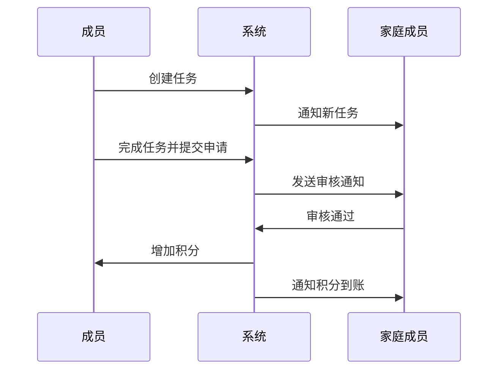
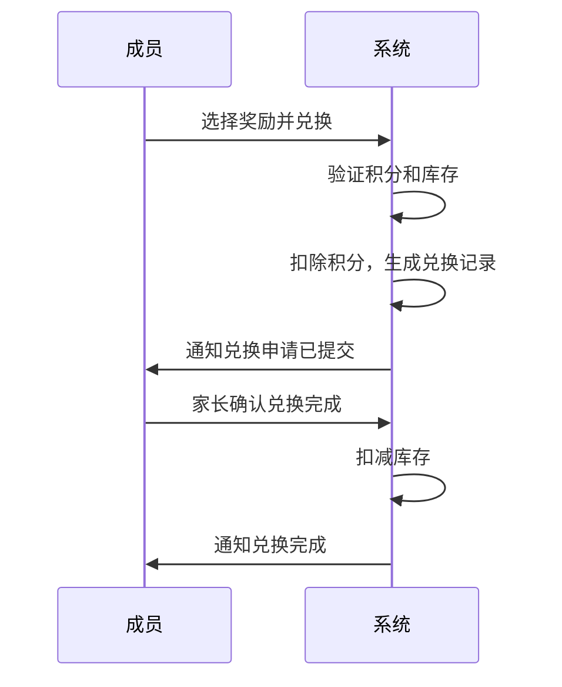

# 家庭任务积分系统

Feature Name: family-task-points
Updated: 2026-03-30

## 1. 描述

家庭任务积分系统是一个支持多用户、以家庭为单位、通过完成家庭任务获取积分并在积分商城兑换奖励的应用。系统采用微信小程序和H5网页版双端架构，后端提供RESTful API服务。

## 2. 系统架构


## 3. 技术栈

| 层级 | 技术选型 |
|------|----------|
| 小程序端 | 微信小程序框架 (WXML/WXSS/JavaScript) |
| H5端 | Vue 3 + Vite |
| 后端 | Node.js + Express / NestJS |
| 数据库 | MySQL / PostgreSQL |
| 消息推送 | 微信小程序订阅消息 |

## 4. 数据模型

### 4.1 用户 (User)

| 字段 | 类型 | 说明 |
|------|------|------|
| id | BIGINT | 主键 |
| openid | VARCHAR(128) | 微信OpenID，唯一 |
| nickname | VARCHAR(64) | 昵称 |
| avatar_url | VARCHAR(256) | 头像URL |
| created_at | DATETIME | 创建时间 |

### 4.2 家庭 (Family)

| 字段 | 类型 | 说明 |
|------|------|------|
| id | BIGINT | 主键 |
| name | VARCHAR(64) | 家庭名称 |
| invite_code | VARCHAR(8) | 邀请码（唯一） |
| created_by | BIGINT | 创建者ID |
| created_at | DATETIME | 创建时间 |

### 4.3 家庭成员 (FamilyMember)

| 字段 | 类型 | 说明 |
|------|------|------|
| id | BIGINT | 主键 |
| family_id | BIGINT | 家庭ID |
| user_id | BIGINT | 用户ID |
| role | ENUM('member','admin') | 成员角色 |
| points | INT | 当前积分余额 |
| joined_at | DATETIME | 加入时间 |

### 4.4 任务 (Task)

| 字段 | 类型 | 说明 |
|------|------|------|
| id | BIGINT | 主键 |
| family_id | BIGINT | 家庭ID |
| creator_id | BIGINT | 创建者ID |
| executor_id | BIGINT | 执行者ID |
| title | VARCHAR(128) | 任务标题 |
| description | TEXT | 任务描述 |
| points | INT | 积分奖励 |
| status | ENUM('pending','applying','approved','rejected','expired') | 状态 |
| deadline | DATETIME | 截止日期 |
| created_at | DATETIME | 创建时间 |
| completed_at | DATETIME | 完成时间 |

### 4.5 积分记录 (PointLog)

| 字段 | 类型 | 说明 |
|------|------|------|
| id | BIGINT | 主键 |
| member_id | BIGINT | 成员ID |
| task_id | BIGINT | 关联任务ID（可空） |
| amount | INT | 积分变动数量（正/负） |
| type | ENUM('earn','spend','refund') | 类型 |
| reason | VARCHAR(256) | 变动原因 |
| created_at | DATETIME | 时间 |

### 4.6 奖励 (Reward)

| 字段 | 类型 | 说明 |
|------|------|------|
| id | BIGINT | 主键 |
| family_id | BIGINT | 家庭ID |
| name | VARCHAR(128) | 奖励名称 |
| description | TEXT | 描述 |
| points_price | INT | 所需积分 |
| stock | INT | 库存数量 |
| created_at | DATETIME | 创建时间 |

### 4.7 兑换记录 (Exchange)

| 字段 | 类型 | 说明 |
|------|------|------|
| id | BIGINT | 主键 |
| member_id | BIGINT | 兑换者ID |
| reward_id | BIGINT | 奖励ID |
| points_spent | INT | 消耗积分 |
| status | ENUM('pending','completed','cancelled') | 状态 |
| created_at | DATETIME | 申请时间 |
| completed_at | DATETIME | 完成时间 |

## 5. API 接口

### 5.1 用户模块

| 方法 | 路径 | 说明 |
|------|------|------|
| POST | /api/auth/login | 微信授权登录 |
| GET | /api/user/profile | 获取用户信息 |

### 5.2 家庭模块

| 方法 | 路径 | 说明 |
|------|------|------|
| POST | /api/family/create | 创建家庭 |
| POST | /api/family/join | 加入家庭 |
| GET | /api/family/:id | 获取家庭信息 |
| GET | /api/family/:id/members | 获取家庭成员列表 |
| DELETE | /api/family/:id/leave | 离开家庭 |

### 5.3 任务模块

| 方法 | 路径 | 说明 |
|------|------|------|
| POST | /api/tasks | 创建任务 |
| GET | /api/tasks | 获取任务列表 |
| GET | /api/tasks/:id | 获取任务详情 |
| POST | /api/tasks/:id/apply | 提交完成申请 |
| POST | /api/tasks/:id/approve | 审核通过 |
| POST | /api/tasks/:id/reject | 审核拒绝 |

### 5.4 积分模块

| 方法 | 路径 | 说明 |
|------|------|------|
| GET | /api/points/balance | 获取积分余额 |
| GET | /api/points/logs | 获取积分变动记录 |
| GET | /api/points/ranking | 获取家庭积分排行 |

### 5.5 商城模块

| 方法 | 路径 | 说明 |
|------|------|------|
| POST | /api/rewards | 添加奖励（Admin） |
| GET | /api/rewards | 获取奖励列表 |
| POST | /api/rewards/:id/exchange | 兑换奖励 |
| GET | /api/rewards/exchanges | 获取兑换记录 |
| PATCH | /api/rewards/:id/complete | 确认兑换完成 |

## 6. 核心业务流程

### 6.1 任务积分流程



### 6.2 兑换流程



## 7. 目录结构

```
Home/
├── client/                    # 前端
│   ├── miniprogram/          # 微信小程序
│   │   ├── pages/
│   │   ├── components/
│   │   └── app.js
│   └── h5/                    # H5网页版
│       ├── src/
│       └── index.html
├── server/                    # 后端服务
│   ├── src/
│   │   ├── modules/           # 功能模块
│   │   ├── common/            # 公共模块
│   │   └── main.ts
│   └── package.json
└── README.md
```

## 8. 正确性属性

- 积分余额永远不会为负数
- 兑换操作和积分扣除必须是原子性的
- 同一任务同一时间只能有一个执行人
- 邀请码在家庭内唯一
- 家庭成员离开后积分清零

## 9. 错误处理

| 错误码 | 说明 |
|--------|------|
| 1001 | 用户未登录 |
| 2001 | 家庭不存在 |
| 2002 | 邀请码无效 |
| 2003 | 已在家庭中 |
| 3001 | 任务不存在 |
| 3002 | 任务已过期 |
| 3003 | 积分不足 |
| 4001 | 奖励库存不足 |
| 4002 | 兑换记录不存在 |
